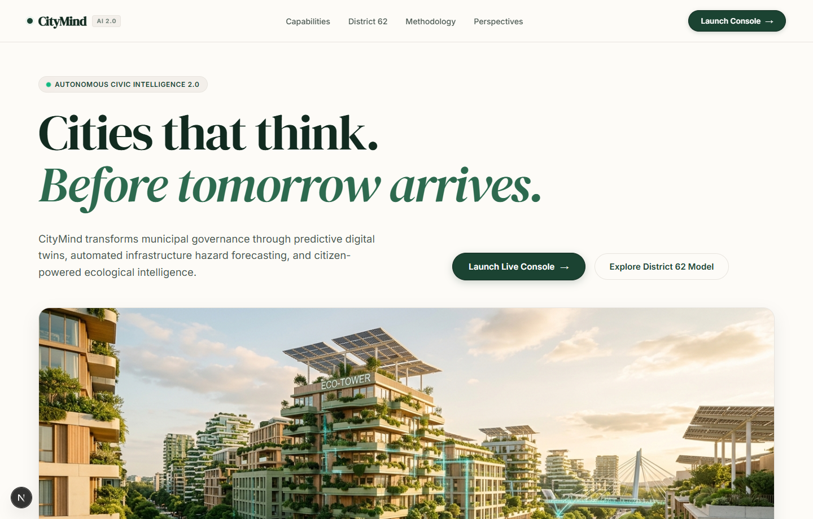
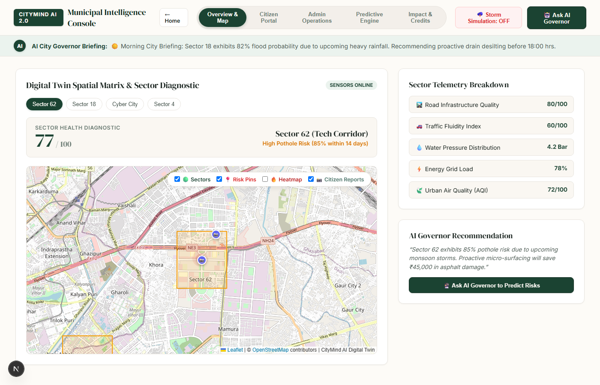
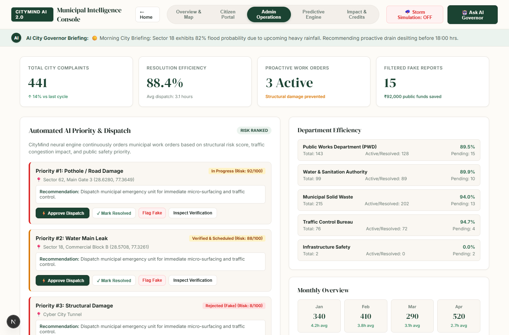
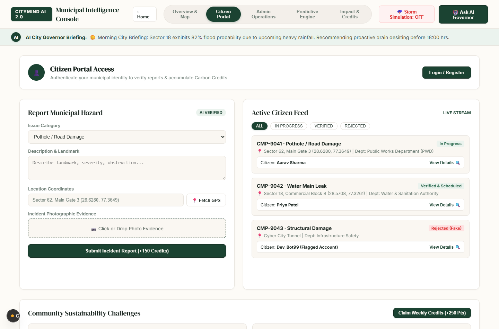
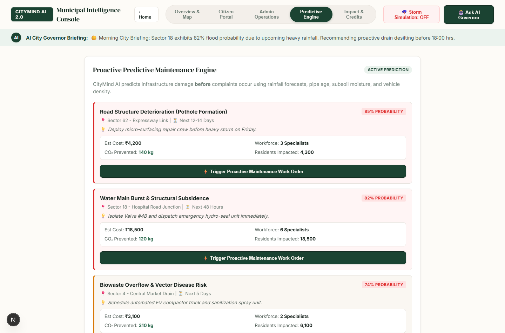
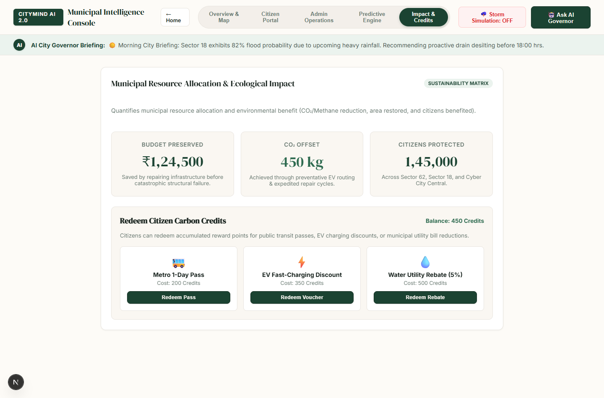

# CityMind AI 2.0 — Municipal Digital Twin & AI Urban Governor

> **An enterprise-grade, proactive municipal intelligence platform combining real-time IoT spatial digital twins, predictive infrastructure failure prevention, automated AI governance, and verified citizen civic engagement.**

---

[](https://nextjs.org/)
[](https://react.dev/)
[](https://leafletjs.com/)
[](https://firebase.google.com/)
[](#design-system)

---

## Table of Contents

- [Executive Summary](#executive-summary)
- [Visual Showcase & Screenshots](#visual-showcase--screenshots)
- [Core Architectural Modules](#core-architectural-modules)
  - [1. Editorial Web Portal & Landing Experience](#1-editorial-web-portal--landing-experience)
  - [2. Interactive Digital Twin GIS Map](#2-interactive-digital-twin-gis-map)
  - [3. AI City Governor & Predictive Risk Engine](#3-ai-city-governor--predictive-risk-engine)
  - [4. Citizen Civic Engagement & Verified Reporting](#4-citizen-civic-engagement--verified-reporting)
  - [5. Municipal Operations & Dispatch Console](#5-municipal-operations--dispatch-console)
  - [6. "What-If" Environmental Stress Simulator](#6-what-if-environmental-stress-simulator)
  - [7. Carbon Credits & Voucher Redemption Engine](#7-carbon-credits--voucher-redemption-engine)
- [System Architecture & Data Flow](#system-architecture--data-flow)
- [Technology Stack](#technology-stack)
- [Getting Started](#getting-started)
  - [Prerequisites](#prerequisites)
  - [Installation](#installation)
  - [Environment Variables](#environment-variables)
  - [Running the Application](#running-the-application)
- [Project Directory Structure](#project-directory-structure)
- [Contributors](#contributors)
- [License](#license)

---

## Executive Summary

Traditional municipal governance operates in a **reactive posture**: citizens encounter infrastructure failures (potholes, water main bursts, grid outages), file complaints, and wait days or weeks for dispatch teams. 

**CityMind AI 2.0** transforms municipal management into a **proactive, predictive ecosystem**. By ingesting multi-modal sensor telemetry, weather forecasts, subsoil moisture readings, and historical asset degradation curves, CityMind predicts infrastructure breakdowns **before** catastrophic failure occurs. Automated decision pipelines schedule preventative maintenance, filter synthetic/fraudulent citizen reports, optimize department budgets, and incentivize sustainable citizen participation through verified carbon credits.

---

## Visual Showcase & Screenshots

### 1. Editorial Landing Page & Masterplan
The public-facing portal presents an architectural, warm editorial aesthetic built on typography, whitespace, and high-craft design principles.



---

### 2. Municipal Digital Twin Spatial Matrix
Real-time GIS mapping powered by Leaflet and OpenStreetMap basemaps, displaying live sector diagnostics, dynamic risk heatmaps, and spatial telemetry.



---

### 3. Administrative Operations & AI Priority Queue
Automated municipal decision-support system ranking incidents by structural severity and traffic impact, with one-click emergency dispatching.



---

### 4. Citizen Civic Engagement & Verified Reporting Portal
Citizens upload geo-tagged photographic evidence, automatically extracted via EXIF metadata, authenticated against synthetic/duplicate AI models, and rewarded with Carbon Credits.



---

### 5. Proactive Predictive Maintenance & "What-If" Simulator
Interactive stress testing matrix enabling urban planners to simulate monsoon storms, asset aging, and heavy commercial vehicle loads to calculate failure probability and saved municipal capital.



---

### 6. Ecological Impact Matrix & Carbon Voucher Redemption
Tracks public capital preserved, CO₂ emissions prevented, and allows citizens to redeem accumulated carbon credits for public transit, EV charging, and utility bill rebates.



---

## Core Architectural Modules

### 1. Editorial Web Portal & Landing Experience
- **Bespoke Typography**: Styled with `DM Serif Display` for headings and `Inter` for micro-legibility.
- **Verdant Warm Palette**: Built on warm cream (`#FDFBF7`), subtle sand (`#F3EFEA`), and deep forest green (`#1B4332`).
- **Comprehensive Narrative**: 9 distinct sections covering vision, live sector metrics, core architectural pillars, and verified citizen workflows.

### 2. Interactive Digital Twin GIS Map
- **Carto Voyager Cartography**: High-resolution, warm neutral cartographic basemap designed for architectural masterplanning.
- **Dynamic Sector Polygons**: Color-coded sector boundaries reflecting real-time health scores (Healthy, Moderate, High-Risk).
- **Multi-Layer Overlays**: Granular toggle controls for Sector boundaries, Hazard pins, Predictive risk heatmaps, and Live citizen reports.
- **Telemetry Diagnostics**: Instant breakdown of Road Quality, Traffic Fluidity, Water Main Pressure, Power Grid Load, and Air Quality (AQI).

### 3. AI City Governor & Predictive Risk Engine
- **Natural Language Decision Terminal**: City administrators query the Governor AI to forecast risks, assess upcoming weather impacts, or inspect sector-specific degradation.
- **Predictive Ticker & Emergency Mode**: Instant situational awareness ticker with one-click **Storm Simulation Mode** that automatically simulates sector flooding, triggers traffic rerouting, and dispatches municipal crews.

### 4. Citizen Civic Engagement & Verified Reporting
- **Automated EXIF Spatial Extraction**: Extracts exact GPS coordinates directly from uploaded image metadata, with live browser geolocation fallback.
- **Multi-Vector AI Verification Pipeline**:
  - *Duplicate Detection*: Detects spatial and visual overlap with existing open complaints to merge duplicates and amplify priority.
  - *Generative AI & Synthetic Fraud Shield*: Analyzes sensor noise and metadata patterns to flag and reject staged or fake images.
  - *Spatial Triangulation*: Validates reported coordinates against city sector boundary polygons.

### 5. Municipal Operations & Dispatch Console
- **Risk-Ranked Dispatch Feed**: Incidents ordered dynamically by structural hazard, emergency risk score, and vehicular traffic volume.
- **Department Workflow Routing**: Automated routing across Public Works Department (PWD), Water & Sanitation Authority, Municipal Solid Waste, and Traffic Control Bureau.
- **Efficiency & Turnaround Tracking**: Real-time tracking of resolution rates, average turnaround hours, and public budget preserved.

### 6. "What-If" Environmental Stress Simulator
- **Multi-Variable Stress Inputs**: Adjust target sectors, weather scenarios (Monsoon 150mm, Heatwave 42°C, Moderate), infrastructure age (2 to 30 years), and traffic density.
- **Neural Failure Forecasting**: Calculates failure probability, estimated preventative repair cost, return on investment (prevented catastrophic repair costs), and CO₂ offset.

### 7. Carbon Credits & Voucher Redemption Engine
- **Civic Incentivization**: Citizens earn verified Carbon Credits for submitting legitimate incident reports, upvoting verified hazards, and completing weekly community challenges.
- **Redemption Kiosk**: Instant issuance of digital vouchers for Metro 1-Day Passes, EV Fast-Charging hub discounts, and Municipal Water Utility bill credits.

---

## System Architecture & Data Flow

```
   ┌────────────────────────────────────────────────────────┐
   │                   Citizen & Public Layer               │
   │  · Photo Upload (EXIF GPS)  · Carbon Credits Kiosk     │
   │  · Community Challenges     · Live Status Tracking     │
   └───────────────────────────┬────────────────────────────┘
                               │ HTTP / Multipart
                               ▼
   ┌────────────────────────────────────────────────────────┐
   │             Next.js 15+ App Router Server              │
   │  · /api/city-data (Telemetry, Reports, Simulations)    │
   │  · /api/governor-ai (Risk Prediction, RAG Querying)    │
   │  · EXIF Parser & Coordinate Extractor                  │
   └─────────────┬────────────────────────────┬─────────────┘
                 │                            │
                 ▼                            ▼
   ┌──────────────────────────┐ ┌───────────────────────────┐
   │  Firebase Cloud Storage  │ │   Firebase Firestore DB   │
   │  · Incident Evidence     │ │   · Live Incident Stream  │
   │  · User Profiles         │ │   · Sector Telemetry      │
   └──────────────────────────┘ └───────────────────────────┘
                 ▲                            ▲
                 └─────────────┬──────────────┘
                               │ Real-time Snapshot
   ┌───────────────────────────┴────────────────────────────┐
   │               Municipal Admin Console Layer            │
   │  · Leaflet GIS Digital Twin Matrix                     │
   │  · AI Risk Ranking & One-Click Dispatch                │
   │  · Department Work Orders & Budget Optimization        │
   │  · "What-If" Neural Environmental Simulator            │
   └────────────────────────────────────────────────────────┘
```

---

## Technology Stack

| Layer | Technology | Purpose |
| :--- | :--- | :--- |
| **Frontend Framework** | Next.js 16 (App Router) | High-performance server/client component architecture |
| **UI Library** | React 19 | Declarative UI state management and hooks |
| **Styling & Design System** | Bespoke Vanilla CSS | Warm Editorial Design System, Bento Box layouts, CSS Variables |
| **Typography** | Google Fonts | `DM Serif Display`, `Inter`, `JetBrains Mono` |
| **GIS & Spatial Engine** | Leaflet.js & Carto Voyager | Interactive spatial mapping, polygon overlays, risk heatmaps |
| **Backend API** | Next.js Route Handlers | RESTful endpoints for telemetry, AI Governor, and simulations |
| **Database & Sync** | Firebase Firestore | Real-time incident streaming, report synchronization |
| **Authentication** | Firebase Auth | Secure citizen identity authentication and session management |
| **Image & EXIF Processing** | ExifReader | Hardware camera GPS coordinate extraction |
| **Micro-Interactions** | Canvas Confetti | Gamified celebratory feedback for reward redemptions |

---

## Getting Started

### Prerequisites

Ensure you have the following installed on your local environment:
- **Node.js**: `v18.17.0` or higher (tested with `v20+` and `v24+`)
- **npm** or **pnpm** or **yarn**
- Modern Web Browser (Chrome, Edge, Firefox, Safari)

### Installation

1. **Clone the repository:**
   ```bash
   git clone https://github.com/anshkumar7652/CityMind-AI.git
   cd CityMind-AI/citymind-app
   ```

2. **Install project dependencies:**
   ```bash
   npm install
   ```

### Environment Variables

Create a `.env.local` file in the `citymind-app` directory:

```env
# Optional Firebase Configuration (Fallback offline data is enabled by default)
NEXT_PUBLIC_FIREBASE_API_KEY=your_api_key_here
NEXT_PUBLIC_FIREBASE_AUTH_DOMAIN=your_project.firebaseapp.com
NEXT_PUBLIC_FIREBASE_PROJECT_ID=your_project_id
NEXT_PUBLIC_FIREBASE_STORAGE_BUCKET=your_project.appspot.com
NEXT_PUBLIC_FIREBASE_MESSAGING_SENDER_ID=your_messaging_id
NEXT_PUBLIC_FIREBASE_APP_ID=your_app_id
```

> **Note**: If Firebase credentials are not provided, CityMind AI runs gracefully with built-in mock telemetry, local storage fallbacks, and demonstration state.

### Running the Application

1. **Start the development server:**
   ```bash
   npm run dev
   ```

2. **Access the application:**
   - **Public Editorial Landing Portal**: [http://localhost:3000](http://localhost:3000)
   - **Municipal Intelligence Console**: [http://localhost:3000/dashboard](http://localhost:3000/dashboard)

3. **Build for production:**
   ```bash
   npm run build
   npm run start
   ```

---

## Project Directory Structure

```
CityMind-AI/
├── docs/
│   └── screenshots/              # High-resolution screenshots for documentation
├── citymind-app/
│   ├── app/
│   │   ├── api/
│   │   │   ├── city-data/        # Telemetry & incident reporting endpoints
│   │   │   └── governor-ai/      # AI Governor prediction & query endpoint
│   │   ├── dashboard/
│   │   │   ├── layout.js         # Dashboard layout wrapper
│   │   │   └── page.js           # Main Municipal Console & Tab Orchestration
│   │   ├── favicon.ico
│   │   ├── globals.css           # Complete Editorial Design System & Tokens
│   │   ├── layout.js             # Root Application Layout & Typography
│   │   └── page.js               # 9-Section Editorial Landing Page
│   ├── components/
│   │   ├── AdminDashboard.jsx    # Administrative Operations & AI Priority Queue
│   │   ├── CitizenPortal.jsx     # Citizen Incident Reporting & Challenges
│   │   ├── DigitalTwinMap.jsx    # Leaflet GIS Engine & Spatial Layers
│   │   ├── PredictiveSimulator.jsx # "What-If" Environmental Risk Matrix
│   │   └── VoucherModal.jsx      # Ticket-Style Carbon Credit Redemption Pass
│   ├── lib/
│   │   ├── data.js               # Sector telemetries, hazards, vouchers & mocks
│   │   ├── exif-gps.js           # Photographic EXIF coordinate extractor
│   │   └── firebase.js           # Firebase app initialization & config guard
│   ├── public/
│   │   ├── images/               # Architectural photography & masterplan assets
│   │   └── screenshots/          # Embedded website screenshots
│   └── package.json
└── README.md                     # Root Repository Documentation
```

---

## Contributors

- [Ansh Kumar](https://github.com/anshkumar7652) — Responsible for the overall development and implementation of the project, including frontend design and development, backend development, database integration, core feature implementation, API integration, system integration, testing, debugging, and finalization.
- [Aryan Singh](https://github.com/aryansingh173-cyber) — Contributed during the initial ideation and planning stage by helping with architectural design, project direction, identifying core features, and testing the project.

---

## License

This project is licensed under the [MIT License](LICENSE) — see the LICENSE file for details.
